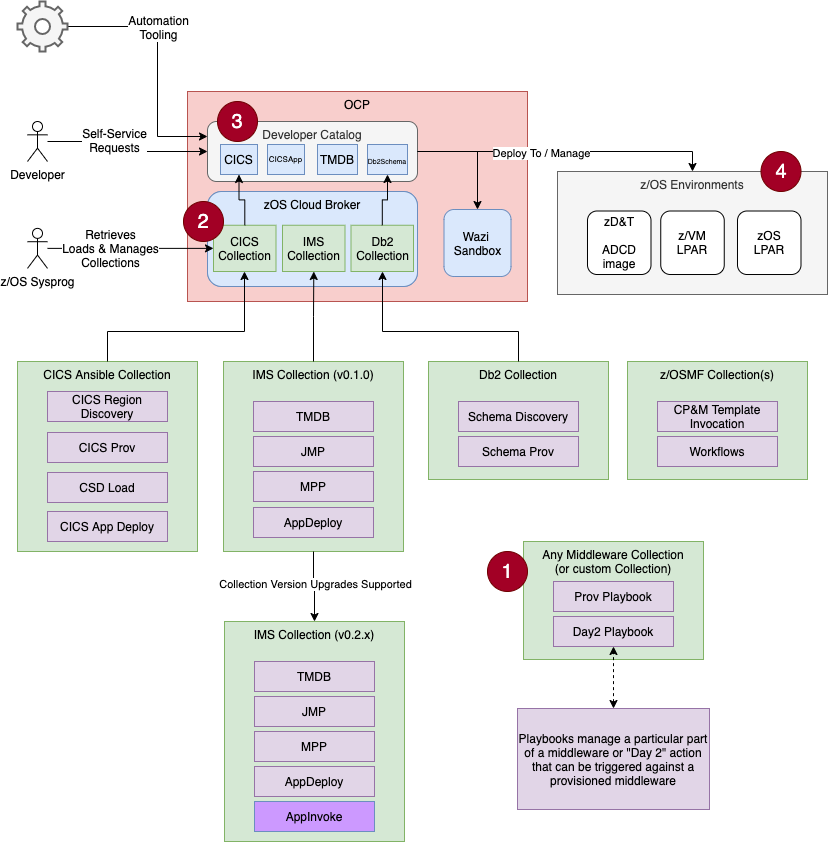

# Operator Collection Lifecycle <!-- omit from toc -->
This document explains the lifecycle capabilities of Kubernetes Operators and how OperatorCollections can be used throughout this lifecycle.

- [Standalone Ansible Collection](#standalone-ansible-collection)
  - [Discovery](#discovery)
  - [Provisioning \& Management](#provisioning--management)
  - [Day 2 Actions](#day-2-actions)
- [Consumable Services](#consumable-services)

## Standalone Ansible Collection
The base of an Operator Collection is just a standard Ansible Collection. 

It is intended that these Ansible Collections can be invoked directly on a local machine or build server. This becomes an easy environment for clients to work on their automated tasks, while also handling basic automation around invoking these playbooks. 

An Ansible Collection that is intended to become an Operator Collection may have multiple playbooks to manage phases of a particular middleware product or any automatable tasks on a target environment, such as software installation.

Lifecycle phases that may be relevant for managing remote systems include:
1. Discovery
1. Provisioning & Management
1. Day 2 Actions

### Discovery
Discovery playbooks connect to a z/OS environment and return information that can be registered into OCP for future usage. 

When a Discovery Playbook runs, it can create Custom Resource instances in OCP for stateful management. Those discovered resources can be automatically converted to instances managed by a "Provisioning & Management" Operator with proper implementation of the provisioning playbook for handling discovered resources.

In a more likely scenario, Discovery playbooks will populate OCP with CR instances that may be used as references for Day 2 actions that can be triggered in the OCP UI.

For example, Discover IMS Control Regions (`TMDB`) on a z/OS so that you can create a Dependent Region (`MPP`) that belongs to that Control Region.

### Provisioning & Management
This a typical playbook that creates a resource instance on a z/OS environment. What you define as a "resource" is up to you. 

It could be:
- An instance of a middleware environment
- A set of software products
- Any automatable task

To align with Kubernetes Operator models, resources should be able to be created, updated (reconciled) and deleted. Reconcile and delete phases are optional. 

During reconcile, the playbook should be able to take in some unique identifier variable inputs that were provided during provisioning, and run any update or health check automation steps against the retrieved resource instance.

### Day 2 Actions
Day 2 actions are actions that can be taken against a resource instance that was either discovered or provisoned. 

This is intended for automation tasks like:
- Deploying applications
- Gathering logs
- Running monitoring tasks
- Performing backups
- Anything that can be done against an instance

## Consumable Services
After an Operator Collection has been imported and configured, the resources defined in the operator collection are available to users in the OCP Catalog for self-service management.

A SubOperator can be installed for everyone in the cluster via the `openshift-marketplace` namespace, or to a set of specific namespaces that will be allowed to consume the SubOperator and its provided APIs (CRs).

A developer or administrator can then create instances of resources managed by the Operator via the OCP Catalogs just like other containerized products on OCP.

These instances are just standard YAML formatted Kubernetes Custom Resources, and for that reason, they are great for properly adding to SCM for a declarative way to control the state of your z/OS machine. This YAML file can be easily applied via external automation tasks that are owned by a CI/CD toolchain. 