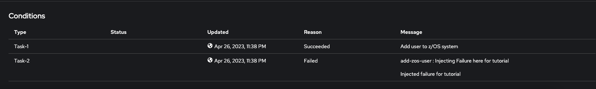

# Operator Collection Tutorial

# Prerequisites
- [Openshift Cluster (version 4.10 or later)][openshift]
- [OpenShift Command Line Interface (CLI)][openshift-cli]
- [Ansible CLI Tools (version 2.7 or later)][ansible]
- [Kubernetes Python Client][kubernetes]
- [z/OS Cloud Broker v2.2.0+][broker]
- [z/OC Cloud Broker Encryption CLI][cli] (optional)


# Overview
This tutorial is walkthrough of building an Operator Collection that performs RACF user management against a z/OS environment

# Install the Operator Collection SDK
Install the latest verions of Operator Collection SDK:

```bash
ansible-galaxy collection install git@github.com:IBM/operator-collection-sdk.git#ibm/operator_collection_sdk -f
```

or when using an alias:

```bash
ocsdk-install
```

# Initialize a new Operator Collection
Run the following command to initialize a new Operator Collection:

```bash
ansible-playbook ibm.operator_collection_sdk.init_collection.yml 
```

or when using an alias:

```bash
ocsdk-init
```


You will then be prompted to enter your collection name and Ansible Galaxy namespace. For the Collection Name enter `racf_operator`. For the Ansible Galaxy namespace, enter the name of your existing namespace in Ansible Galaxy. (Note: A valid Ansible Galaxy namespace is only required if you will like to publish this collection to Ansible Galaxy after completion)

You should now see an an Operator Collection scaffold in the `./<galaxy-namespace>/<collection-name>` directory. Navigate to this directory as this will be where we will working for the remainder of this tutorial

# Apply collection modifications
## Update collection requirements
Update the `collections/requirements.yml` file to add the `ibm.ibm_zos_core` collection

`collections/requirements.yml` file
```bash
collections:
  - name: operator_sdk.util
    version: "0.4.0"
  - name: kubernetes.core
    version: "2.4.0"
  - name: ibm.ibm_zos_core
```

## Apply Playbooks and Role
Copy the `playbooks/` directory from the [racf-operator example][racf-operator] and replace the files in your current `playbooks/` directory.

The playbooks and roles in this directory will become your operator controller logic that executes for every operator instances that create by the end user in Openshift. 
- `add-user.yml` - This playbook will create a new user ID on the z/OS environment
- `remove-user.yml` - This playbook will remove a user ID from the z/OS environment

**Note:** Playbooks MUST use the `hosts: all` parameter. Operator Collection's target hosts are driven using z/OS Endpoints provided by the IBM® z/OS Cloud Broker. When the Ansible Playbook is executed by the IBM® z/OS Cloud Broker, the `hosts: all` value is limited to the selected z/OS Endpoint by setting the --limit flag. This is done internally by the IBM® z/OS Cloud Broker and no additional playbook modifications must be made to handle host limiting.

## Update the operator-config
The `operator-config.yml` file contains the metadata needed for the IBM® z/OS Cloud Broker to configure you operator in Openshift. This file is used to configure things such as the name, description, and icon to be displayed in your operator. This is also where you will configure the name of the [custom resource][custom-resource] to be generated in Openshift, which we will discuss in more details below.

**Let's start by configuring the `domain`, `name`, `version`, `displayName`, and `description` of our operator:**

```bash
domain: <galaxy-namespace> # Convert underscores to dashes
name: racf
version: 1.0.0
displayName: RACF Operator
description: >-
  # z/OS RACF Operator
  
  This operator allows users to create and delete user IDs on z/OS.
```

**Now let's configure our new [custom resource][custom-resource]:**

A custom resource is an object that extends the Kubernetes API or allows you to introduce your own API into a project or a cluster. In this example we will be introducing a new custom resource called `ZosUserId`. This will allow Openshift users the ability to call our new `ZosUserId` API to create user Id's on a z/OS endpoint.

When creating our new custom resource, we also need to configure our operator with the playbook to execute when a new custom resource instance is created by the user, and the playbook to execute when the custom resource instance is deleted. This is done by supplying these playbook locations in the `playbook` and [finalizer][finalizers] fields respectively. 


```bash
resources:
  - kind: ZosUserId
    displayName: z/OS User Id
    description: A User ID managed by the RACF security facility on z/OS.
    playbook: playbooks/add-user.yml
    finalizer: playbooks/remove-user.yml
```

**Now we need to configure the variables needed to execute our playboooks.**

The `add-user` playbook requires two variables that must be supplied from the user. Those variables are `name`, and `userid`. The `remove-user` playbook also accepts the `userid` variable. To promot the user for these values in Openshift, we must configure these variables in the `vars` section of our new custom resource, so that the IBM® z/OS Cloud Broker can configure our operator to request these values from the user. Once configured, these values will be supplied to the playbook as "extra vars" (-e) input parameters during execution.

```bash
vars:
    - name: name
    displayName: Real Name
    description: Specifies the user name to be associated with the new user ID.
    type: string
    required: true
    - name: userid
    displayName: User ID
    description: Specifies the user to be defined to RACF.
    type: string
    required: true
```

**Last, we'll supply a based64-encoded icon for our operator.**

```bash
icon:
  - base64data: >-
      PHN2ZyBpZD0iaWNvbiIgeG1sbnM9Imh0dHA6Ly93d3cudzMub3JnLzIwMDAvc3ZnIiB2aWV3Qm94PSIwIDAgMzIgMzIiPjxkZWZzPjxzdHlsZT4uY2xzLTF7ZmlsbDpub25lO308L3N0eWxlPjwvZGVmcz48dGl0bGU+dXNlcjwvdGl0bGU+PHBhdGggZD0iTTE2LDRhNSw1LDAsMSwxLTUsNSw1LDUsMCwwLDEsNS01bTAtMmE3LDcsMCwxLDAsNyw3QTcsNywwLDAsMCwxNiwyWiIvPjxwYXRoIGQ9Ik0yNiwzMEgyNFYyNWE1LDUsMCwwLDAtNS01SDEzYTUsNSwwLDAsMC01LDV2NUg2VjI1YTcsNywwLDAsMSw3LTdoNmE3LDcsMCwwLDEsNyw3WiIvPjxyZWN0IGlkPSJfVHJhbnNwYXJlbnRfUmVjdGFuZ2xlXyIgZGF0YS1uYW1lPSImbHQ7VHJhbnNwYXJlbnQgUmVjdGFuZ2xlJmd0OyIgY2xhc3M9ImNscy0xIiB3aWR0aD0iMzIiIGhlaWdodD0iMzIiLz48L3N2Zz4=
    mediatype: image/svg+xml
```

In the end, your `operator-config.yml` field should look like simlar to the example [here][operator-config-example].


[openshift]:https://www.redhat.com/en/technologies/cloud-computing/openshift
[openshift-cli]:https://docs.openshift.com/container-platform/4.12/cli_reference/openshift_cli/getting-started-cli.html
[ansible]:https://docs.ansible.com/ansible/latest/installation_guide/intro_installation.html#pip-install
[cli]:https://www.ibm.com/docs/en/cloud-paks/z-modernization-stack/2023.1?topic=credentials-installing-zoscb-encrypt-cli-tool
[kubernetes]:https://github.com/kubernetes-client/python#installation
[broker]:https://ibm.biz/ibm-zoscb-install
[racf-operator]:../examples/racf-operator/playbooks/
[custom-resource]: https://docs.openshift.com/container-platform/3.11/admin_guide/custom_resource_definitions.html
[finalizers]: https://kubernetes.io/docs/concepts/overview/working-with-objects/finalizers/
[operator-config-example]: ../examples/racf-operator/operator-config.yml

## Create the operator
Now that we've applied our playbooks and updated our `operator-config`, we can now build our collection and create an operator in Openshift to validate our changes.

To do that you should first install the latest release in the `v2.2` channel of the IBM® z/OS Cloud Broker in your namespace, and create an instance of the `ZosCloudBroker` resource. Once the installation is successful, you should then log into the cluster from your command line using the `oc login` command, and validating that your are in the correct project using the `oc project` command

Now you should be able to execure the following command using the Operator Collection SDK to build your collection and create an operator:

```bash
ANSIBLE_JINJA2_NATIVE=true ansible-playbook ibm.operator_collection_sdk.create_operator.yml
```

or when using an alias:

```bash
ocsdk-create-operator
```

This command should now prompt you for the z/OS endpoint you would like to execute this operator against, and the SSH credentials needed to access this endpoint.

```bash
Enter your ZosEndpoint name: wazi-sandbox
Enter your ZosEndpoint host: ***HOST_REMOVED***
Enter your ZosEndpoint port [22]: 32281
Enter you SSH Username for this endpoint (Press Enter to skip if the zoscb-encrypt CLI isn't installed): ibmuser
Enter the path to your private SSH Key for this endpoint (Press Enter to skip if the zoscb-encrypt CLI isn't installed): ~/.ssh/id_rsa
Enter the passphrase for the  SSH Key for this endpoint (Press Enter to skip if the zoscb-encrypt CLI isn't installed):
```

**Note:** The SSH credentials are optional when creating the operator. If SSH credentials are not supplied, then your operator will be configured using the `personal` credential type, which will require that a credential be generated using the `zoscb-encrypt` CLI prior to creating an instance of the operator.


Once the installation completes, you should now see the RACF Operator in Openshift under Operators > Installed Operators.

## Create an instance of the operator
In the insalled operator in Openshift, you can now attempt to create an instance of the operator. Create an instance by supplying the required values and click `Create`

**Note:** The initial creation will fail due to an injected failure, but we will correct this failure in the following debugging stage.

## Debugging the operator
There are multiple ways to debug failures in the operator. The first way would be to open the newly created instance and scroll down to the `Conditions` section to see if a task message is displaying with a `Failed` Reason.



Another way would be to scan the `Pod` logs under Workloads > Pods > <racf-operator-podname>. Once you click on the Logs tab in the pod you should see the task failure displayed at the bottom of the log.

If for some reason both the `Conditions` and the `Pod` logs aren't displaying the failure, then you can access the verbose logs within the container itself. To access these logs do the following :
1. Click on the `Terminal` within the `Pod`
2. `cd` into the `/tmp/ansible-operator/runner/suboperator.zoscb.ibm.com/<api-version>/ZosUserId/<ocp-namespace>/<instance-name>/artifacts/latest/` directory and `cat` the `stdout` file

To resolve this failure, you should remove the task named "Injecting Failure here for tutorial" in the  `playbooks/roles/add-zos-user/tasks/main.yml` file.

After removing this task, run the following command to publish this playbook modification to the installed operator Pod:

```bash
ansible-playbook ibm.operator_collection_sdk.redeploy_collection.yml
```

or when using an alias:

```bash
ocsdk-redeploy-collection 
```

After the operator Pod restarts, the previously create instance in the namespace should reconcile automatically and create the requested user Id on the z/OS endpoint.

Now, let's attempt to add another task that emails the generated password to the user. This task will require a new variable called `email_to`, which will allow use to go through the end to end flow of the steps required to append a new variable to an existing operator. 

First, we should uncomment the task named "Send email containing login credentials to {{ email_to }}" in `playbooks/roles/add-zos-user/tasks/main.yml`. Then, we need to update the `operator-config.yml` file to add a new variabled called `email_to`

```bash
- name: email_to
  displayName: Email
  description: Email address to send the new user credentials
  type: string
  required: true
```

**Note:** When adding new required variables, this will cause an error in Openshift if there are existing instances in the namespace, since those instances wouldn't have the new required variable in their `spec`. To avoid this error, you should first remove all existing instances for this custom resource before applying this new config.

Since we are now updating the `operator-config` to display a new variable to the user, we should now run the command below to redeploy the entire operator, and not just redeploy the collection as we've done previously:

```bash
ansible-playbook ibm.operator_collection_sdk.redeploy_operator.yml
```

or when using an alias:

```bash
ocsdk-redeploy-operator
```

After the redeploy is successful, you should now be able to create a new instance, and also supply an email address for the credendials to be sent after completion.

**Note:** An email will not be sent to the requested email ID since this is a fake task that simply prints a debug statement.

## Cleanup

Once you have validated that your operator runs successfully, you can now delete the operator from your namespace:

```bash
ansible-playbook ibm.operator_collection_sdk.delete_operator.yml
```

or when using an alias:

```bash
ocsdk-delete-operator
```
